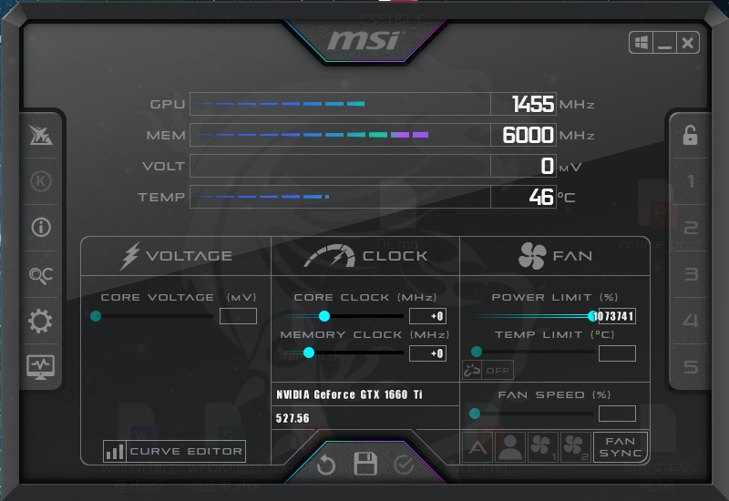
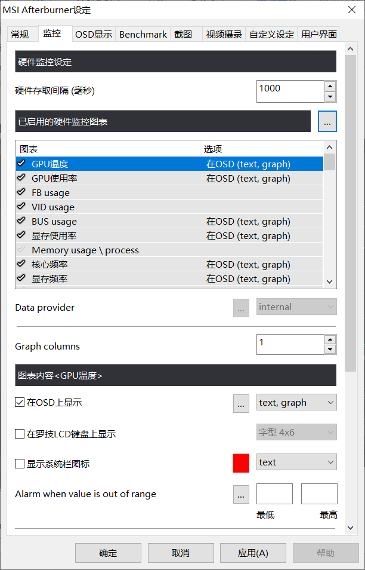

# Group2_cloudgame
# Local Load Testing
In this section, we will test the computer's load and network usage when running two games locally and in the cloud.
# 1. The tools we used
We used the MSI Afterburner tool to monitor the computer's load. MSI Afterburner is a renowned graphics card utility that allows users to overclock and monitor their system's performance. It provides real-time data on GPU temperature, usage, frame rates and other information to monitor the computer’s real-time load. Moreover, the monitoring data from MSI Afterburner can be exported and further processed to convert it into the CSV file format for analysis.

 	
The image  is the main interface of MSI Afterburner. The second image shows the interface for setting up monitoring features. The image in the bottom left corner is the log interface of MSI Afterburner.

We also used GlassWire software to monitor the network traffic used by each application. GlassWire is a network security application that provides users with the ability to monitor and manage their internet activity. It visualizes past and present network activity in an easy-to-understand graph, alerts users to potential threats, and manages firewall settings.
 
The image above shows the traffic monitoring interface of GlassWire software. It can display real-time traffic usage for each application and record the traffic usage over a period of time.

# 2. Testing games running locally and in the cloud
We selected two games, Honkai: Star Rail and Alan wake 2, to test their impact on computer load when running locally and in the cloud.

The testing process is as follows:

1. Run the game locally and record the computer load during a similar duration and similar scenes.
2. Run the game using cloud gaming and record the computer load during a similar duration and similar scenes.
3. Export the load information from MSI Afterburner logs and process it to generate CSV files for both local and cloud gaming scenarios.
4. Use Python to read and analyze the CSV files, extracting relevant data for further analysis and visualization.
5. Compare the computer load between local and cloud gaming scenarios to evaluate the impact on system performance.
